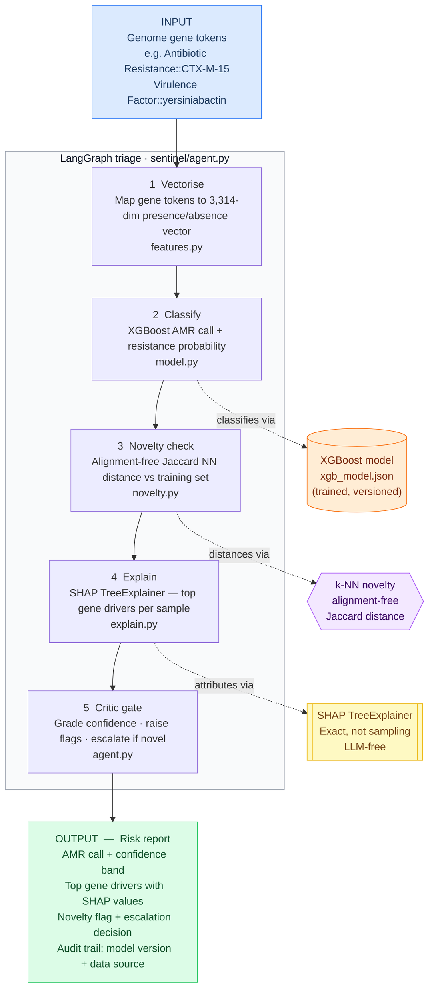

# SENTINEL

_Named after the network of sentinels that watches for threats before they become outbreaks._  
_In microbial surveillance, one resistant organism matters._

[](https://github.com/ankurgenomics/sentinel-amr/actions/workflows/tests.yml)
[](https://www.python.org/downloads/)
[](LICENSE)
[](https://xgboost.readthedocs.io/)
[](https://github.com/langchain-ai/langgraph)
[](https://github.com/astral-sh/uv)

&nbsp;

Problem · Results · What makes it different · Evaluation · Stack · How it works · Quick start · Layout · Limitations

---

**SENTINEL is an explainable, agentic AMR classifier for bacterial pathogen surveillance.**
It takes a genome's curated gene content, independently predicts antimicrobial resistance,
explains every call with the actual resistance genes that drove it, detects organisms it has
never seen before, and escalates uncertainty to a human — with a full audit trail at every step.

&nbsp;

| ROC-AUC | PR-AUC | Accuracy | Novel-organism escalation | Runs offline |
| ------- | ------ | -------- | ------------------------- | ------------ |
| **0.894** | **0.863** | **0.810** | **yes — alignment-free OOD** | **no API keys needed** |

---

## The problem

Antimicrobial resistance surveillance produces genomic data faster than it produces
decisions. A genomic epidemiologist needs to know: is this isolate resistant, why, and
should I trust this call at all? Classical bioinformatics pipelines answer the first
question. They rarely answer the second. They almost never answer the third.

The hardest case is the one that matters most: a sample that matches nothing in the
database. A classifier trained on *K. pneumoniae* will still produce a confident-looking
probability for an environmental isolate it has never seen — and be wrong in a way that
is invisible unless someone explicitly checks.

SENTINEL does not replace the microbiologist. It makes sure the microbiologist is
looking at the right genome, with the right gene-level evidence, and knows when to
stop trusting the model.

---

## What it catches

Three real scenarios, reproduced by `make demo` with no API keys or network:

**Resistant call with named drivers.** A *K. pneumoniae* isolate correctly flagged
Resistant. SHAP identifies CTX-M-15 (ESBL β-lactamase), `dfrA14` (trimethoprim
resistance), and `acrAB` efflux regulator as the top drivers — signals a microbiologist
will immediately recognise as correct.

**Low-confidence call → human review.** A borderline isolate where the model's
probability sits near the decision boundary. The critic gate downgrades confidence
to `low` and the report says *confirm with phenotypic AST* rather than auto-deciding.

**Novel organism → escalation.** A synthetic sample with no database-matching genes.
Jaccard novelty distance = 1.0. The pipeline explicitly refuses to trust its own
probability and raises `NOVEL_ORGANISM — escalate for human review`.

```
$ make demo-novel

=== 573.18697 ===
  decision      : Resistant  (p=0.847, confidence=high)
  novelty       : dist=0.12 novel=False
  top drivers   :
     +0.412  Antibiotic R  CTX-M-15
     +0.291  Antibiotic R  dfrA14
     +0.187  Antibiotic R  acrAB efflux regulator
     +0.163  Antibiotic R  DNA topoisomerase IV subunit A
     +0.089  Virulence     yersiniabactin siderophore
  flags         :
     - HIGH_RESISTANCE_PROBABILITY
     - ANTIBIOTIC_STEWARDSHIP_REVIEW

=== SYNTHETIC_NOVEL_001 ===
  decision      : Resistant  (p=0.761, confidence=low)
  novelty       : dist=1.0 novel=True
  flags         :
     - NOVEL_ORGANISM — escalate for human review
     - LOW_CONFIDENCE — do not act without confirmation
  report        : output/SYNTHETIC_NOVEL_001_report.md
```

---

## What makes it different

**The novelty check is first-class, not an afterthought.** Most AMR classifiers will
produce a probability for any input — including organisms the model has never encountered.
SENTINEL's alignment-free nearest-neighbour gate explicitly catches out-of-distribution
samples and blocks the automated call before it reaches a report. That is the
PathogenFinder2 insight applied to the triage layer.

**Every call is grounded in named genes.** SHAP TreeExplainer attributes each prediction
to specific gene tokens from CARD (AMR) and VFDB (virulence factor) — not abstract
feature indices. A reviewer can verify any driver in a CARD entry in under a minute.

**The evaluation is honest about the split.** `GroupShuffleSplit` on assembly-ID clusters
ensures that related isolates never straddle the train/test boundary. The 50/17 group split
(214 train / 84 test genomes) produces genuine generalisation numbers, not inflated ones.

**The agent is bounded.** The LangGraph critic node is a single-pass gate — it cannot
loop, rewrite, or compound errors. The same inputs always produce the same decision.
Auditable and reproducible.

---

## Evaluation

Trained and evaluated on **298 real *K. pneumoniae* genomes** from BV-BRC (PATRIC),
labelled by laboratory AST, predicting ciprofloxacin resistance.

| Metric | Value |
| ------ | ----- |
| ROC-AUC (held-out) | **0.894** |
| PR-AUC (average precision) | **0.863** |
| Accuracy | **0.810** |
| Train / test genomes | **214 / 84** |
| Gene features | **3,314** |
| Split | **GroupShuffleSplit — 50 train groups / 17 test groups; related isolates never straddle the split** |

The model is good but not perfect — which is precisely *why* SENTINEL wraps it in
confidence gating, novelty detection, and human-in-the-loop escalation rather than
auto-deciding.

The model independently rediscovered correct biology: top global drivers are `CTX-M-15`
(ESBL β-lactamase), `dfrA14` (dihydrofolate reductase / trimethoprim resistance),
`acrAB` efflux regulator, and DNA topoisomerase IV — the literal fluoroquinolone target.

Reproduced by `make eval`.

---

## Technology stack

| Layer | Technology | Where in this repo |
| ----- | ---------- | ------------------- |
| **ML model** | XGBoost (gradient-boosted trees) | `sentinel/model.py` — group-aware train + honest eval + plots |
| **Explainability** | SHAP TreeExplainer | `sentinel/explain.py` — global + per-sample, gene-token attribution |
| **Novelty detection** | Alignment-free Jaccard NN | `sentinel/novelty.py` — k-NN distance against training set; configurable threshold |
| **Agentic pipeline** | LangGraph StateGraph | `sentinel/agent.py` — 5-node bounded graph; critic gate; no cyclic rewrite |
| **Report generation** | Pure Python | `sentinel/report.py` — markdown for risk officers, JSON for LIMS |
| **Data layer** | BV-BRC REST API | `sentinel/fetch_data.py` — `genome_amr` AST labels + `sp_gene` CARD/VFDB features |
| **Feature engineering** | Gene presence/absence | `sentinel/features.py` — token parsing, GroupShuffleSplit, vocab management |
| **Tests** | pytest (offline) | `tests/test_sentinel.py` — 8 tests covering dataset contract, group split, novelty, agent paths |

**Dependency injection for testability.** The agent accepts any token list — the demo
uses held-out BV-BRC genomes, tests use fabricated tokens, live runs pull from the API.
No mocking required; the same code path runs in all three contexts.

---

## How it works

### Pipeline



### What each step does

| Step | What happens | File |
| ---- | ------------ | ---- |
| **Vectorise** | Map CARD/VFDB gene token strings to a fixed 3,314-dim binary vector using the committed vocabulary | `sentinel/features.py` |
| **Classify** | XGBoost predicts resistance probability; confidence band assigned by threshold (high / medium / low) | `sentinel/model.py` |
| **Novelty check** | Jaccard distance to k nearest training genomes; flag if distance > calibrated threshold | `sentinel/novelty.py` |
| **Explain** | SHAP TreeExplainer (exact, not sampling) attributes prediction to individual gene tokens | `sentinel/explain.py` |
| **Critic gate** | Aggregates flags; downgrades confidence for novel / borderline cases; writes markdown + JSON report | `sentinel/agent.py`, `sentinel/report.py` |

### Where the model fits — and where it does not

```
AMR call                 ──►  XGBoost only         (deterministic, reproducible)
Gene attribution         ──►  SHAP TreeExplainer    (exact, not sampling)
Novel-organism decision  ──►  Jaccard NN gate       (blocks the model when it shouldn't be trusted)
```

The agent has no LLM dependency. The demo, all tests, and the live path run identically
without any API keys.

### What the output contains

Every run produces a risk report with four parts:

```
AMR call              the model's binary decision + resistance probability
Confidence band       high / medium / low based on probability distance from threshold
Gene drivers          top 10 SHAP attributions with gene name, category, and direction
Flags                 NOVEL_ORGANISM / HIGH_RESISTANCE_PROBABILITY / LOW_CONFIDENCE / ...
Audit trail           model file, data source, timestamp
```

`NOVEL_ORGANISM` = Jaccard distance exceeds calibrated threshold — automated call is
explicitly not trusted; escalate to human review.
`LOW_CONFIDENCE` = probability within ±0.15 of decision boundary — confirm with
phenotypic AST before acting.

---

## Quick start

```bash
git clone https://github.com/ankurgenomics/sentinel-amr.git
cd sentinel-amr

./run.sh         # one command: venv + deps + train + explain + novelty + demo + tests
```

Or step by step:

```bash
# 1. Environment (Python 3.12; uv recommended)
uv venv --python 3.12 .venv
uv pip install --python .venv -r requirements.txt
brew install libomp          # macOS only: XGBoost requires the OpenMP runtime

# 2. Train + evaluate (writes models/ and metrics/)
make train

# 3. Run the demo
make demo                    # 4 held-out genomes, fully offline
make demo-novel              # same + novel-organism escalation path

# 4. Run tests
make test                    # 8 pytest tests, fully offline

# 5. (optional) Rebuild dataset from BV-BRC (~2 min, needs network)
.venv/bin/python -m sentinel.fetch_data --taxon 573 \
    --antibiotic ciprofloxacin --max-per-class 150
```

---

## Repository layout

```
sentinel/
  fetch_data.py    pull BV-BRC AMR labels + CARD/VFDB gene features
  features.py      gene token parsing, presence/absence vectors, GroupShuffleSplit
  model.py         XGBoost train/eval + group-aware metrics + ROC/PR/SHAP plots
  explain.py       SHAP TreeExplainer — global bar chart + per-sample waterfall
  novelty.py       alignment-free k-NN OOD detection; novelty_score() + calibrate()
  agent.py         bounded LangGraph StateGraph (5 nodes; critic gate; no loops)
  report.py        auditable markdown + JSON risk report
  demo.py          end-to-end demo runner (offline + live BV-BRC mode)

tests/
  test_sentinel.py 8 pytest tests — dataset contract, group-split disjointness,
                   novelty flag, agent end-to-end (known + novel), determinism

data/
  sentinel_dataset.csv   committed real dataset (298 K. pneumoniae genomes)
  dataset_meta.json      provenance: taxon, antibiotic, fetch date, BV-BRC version

metrics/           ROC / PR / confusion / SHAP plots + metrics.json  (generated)
models/            xgb_model.json + feature_names.json               (generated)
output/            per-sample risk reports                            (generated)

run.sh             one-command setup + full pipeline
Makefile           make demo / demo-novel / train / eval / test / lint
SCALING.md         production architecture: ESM-2, pan-genome GNN, VAE novelty, AWS
DEMO_SCRIPT.md     5-minute walkthrough + common questions
```

---

## What is implemented vs. designed

**Implemented and runnable today (this repo):**
- Real BV-BRC data fetch (AST labels + CARD/VFDB gene features)
- XGBoost AMR classifier with honest group-aware evaluation
- SHAP TreeExplainer (exact, not sampling)
- Alignment-free k-NN novelty / out-of-distribution detection
- Bounded LangGraph triage agent + auditable reports
- Offline pytest suite (8 tests)

**Designed, not yet built (see `SCALING.md`):**
- ESM-2 / DNABERT protein-language-model embedding head
- Pan-genome Graph Neural Network (PyTorch Geometric)
- VAE-based novelty detection on embedding space
- Distributed GPU training + streaming surveillance on AWS

The embedding/GNN/VAE pieces are the scale-up path — left as architecture rather
than half-built code. The novelty node here demonstrates the same escalation logic
(refuse to trust an unrecognised organism) with a transparent nearest-neighbour
heuristic that is straightforward to swap out.

---

## Scope and limitations

Single antibiotic / single species in the demo. The `--taxon` and `--antibiotic` flags
in `fetch_data.py` extend to any BV-BRC-labelled species and drug combination.

Gene-presence features depend on BV-BRC's curated gene calls. A raw-read deployment
would add an assembly and annotation front end (rMAP / graphamr style) upstream.

Novelty detection here is a nearest-neighbour heuristic on a 298-genome training set.
The production version uses protein-language-model embeddings and a VAE (see
`SCALING.md`).

Not validated for clinical or regulatory use. All automated calls require qualified
human review before any reportable action.

---

## Data & credit

Data: BV-BRC / PATRIC (`genome_amr`, `sp_gene`), drawing on CARD and VFDB annotations.

Conceptual references:
- PathogenFinder2 (DTU, *Bioinformatics* 2026) — whole-genome pathogenicity prediction on
  novel bacteria via protein language models
- AMR-GNN (Nguyen et al., 2025) — explainable graph neural networks for genomic AMR
- rMAP / graphamr — resistome pipeline framing and report design

---

MIT License
