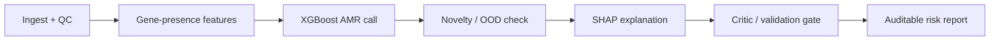

# SENTINEL

**S**urveillance **EN**gine for **T**riage, **I**nterpretation & **N**ovel-pathogen **E**scalation in **L**abs

An explainable, agentic AI/ML prototype for foodborne / clinical pathogen surveillance.
Built as a working demonstration for the **Singapore Food Agency (SFA)** Scientist /
Senior Scientist (Bioinformatics - AI/ML) role.

> One coherent, deployable system - not three disconnected models. A genuinely good
> ML classifier sits *inside* an agentic triage graph that explains itself, flags
> organisms it has never seen, and escalates uncertainty to a human. This mirrors
> exactly how a national surveillance lab would actually use AI: fast, auditable,
> and safe on novel threats.

---

## What it does

Given a bacterial isolate's curated gene content, SENTINEL:

1. **Predicts antimicrobial resistance** (here: *Klebsiella pneumoniae* vs ciprofloxacin) with an XGBoost model.
2. **Explains every call with SHAP** - naming the actual resistance/virulence genes that drove the decision (e.g. `CTX-M-15`, `DNA topoisomerase IV subunit A`, `AcrR` efflux regulator).
3. **Detects novel / out-of-distribution organisms** with an alignment-free nearest-neighbour signal (the PathogenFinder2 insight) and refuses to trust the automated call for them.
4. **Triages via a bounded LangGraph agent** with a critic/validation node that decides whether to escalate to human review.
5. **Emits an auditable risk report** (markdown for a risk officer, JSON for a LIMS/dashboard).



## Honest results (real data, group-aware holdout)

Trained and evaluated on **298 real *K. pneumoniae* genomes** from BV-BRC (PATRIC),
labelled by laboratory AST, with features derived from CARD (AMR genes) and VFDB
(virulence factors) via the BV-BRC `sp_gene` API.

| Metric | Value |
|--------|-------|
| ROC-AUC (held-out) | **0.894** |
| PR-AUC (average precision) | **0.863** |
| Accuracy | **0.810** |
| Train / test genomes | 214 / 84 |
| Gene features | 3,314 |
| Split | **Group-aware** (GroupShuffleSplit on assembly clusters - related isolates never straddle the split) |

These are honest generalisation numbers, not inflated by leakage. The model
is good but not perfect - which is precisely *why* SENTINEL wraps it in confidence
gating, novelty detection, and human-in-the-loop escalation rather than auto-deciding.

The model independently rediscovered correct biology: its top global drivers are
`CTX-M-15`, dihydrofolate reductase / `dfrA14`, the `acrAB` efflux regulator, and
DNA topoisomerase IV (the literal fluoroquinolone target) - signals a microbiologist
will immediately recognise.

## Quickstart

```bash
# Fastest path: one command (creates venv, installs deps, trains, runs demo + tests)
./run.sh
```

Or step by step:

```bash
# 1. Environment (Python 3.12; uv recommended)
uv venv --python 3.12 .venv
uv pip install --python .venv -r requirements.txt
brew install libomp            # macOS only: XGBoost needs the OpenMP runtime

# 2. (optional) rebuild the real dataset from BV-BRC (committed copy ships in data/)
.venv/bin/python -m sentinel.fetch_data --taxon 573 \
    --antibiotic ciprofloxacin --max-per-class 150

# 3. Train + evaluate (writes models/ and metrics/)
.venv/bin/python -m sentinel.model

# 4. Explainability + novelty calibration
.venv/bin/python -m sentinel.explain
.venv/bin/python -m sentinel.novelty

# 5. End-to-end agent demo (offline; add --show-novel for the OOD path)
.venv/bin/python -m sentinel.demo --show-novel

# Live single-genome triage (needs internet)
.venv/bin/python -m sentinel.demo --genome-id 573.18697

# Tests
.venv/bin/python -m pytest -q
```

## Repository layout

| Path | Purpose |
|------|---------|
| `sentinel/fetch_data.py` | Pull real BV-BRC AMR labels + curated gene features |
| `sentinel/features.py` | Gene-presence feature handling, group-aware splitting |
| `sentinel/model.py` | XGBoost train/eval + honest metrics + plots |
| `sentinel/explain.py` | SHAP global + per-sample explanations |
| `sentinel/novelty.py` | Alignment-free OOD / novel-organism detection |
| `sentinel/agent.py` | Bounded LangGraph triage StateGraph |
| `sentinel/report.py` | Auditable markdown + JSON risk report |
| `sentinel/demo.py` | End-to-end demo runner |
| `tests/test_sentinel.py` | Pytest suite (offline; dataset + model contracts + agent paths) |
| `run.sh` | One-command setup + full pipeline |
| `data/` | Committed real dataset (`sentinel_dataset.csv`) + cached API pages |
| `metrics/` | ROC / PR / confusion / SHAP plots + `metrics.json` (generated) |
| `output/` | Generated per-sample risk reports |
| `SCALING.md` | The "money-no-object" national-scale architecture |
| `DEMO_SCRIPT.md` | 5-minute interview walkthrough + Q&A |

## What is implemented vs. designed (read this)

To be precise about scope -- this matters for trust:

**Implemented and runnable today (this repo):**
- Real BV-BRC data fetch (AST labels + CARD/VFDB gene features)
- XGBoost AMR classifier with honest group-aware evaluation
- SHAP explainability (exact TreeExplainer)
- Alignment-free novelty / out-of-distribution detection
- Bounded LangGraph triage agent + auditable reports
- Offline pytest suite

**Designed, not yet built (see `SCALING.md`):**
- ESM-2 / DNABERT protein-language-model embedding head
- Pan-genome Graph Neural Network (PyTorch Geometric)
- VAE-based novelty on embedding space
- Distributed GPU training + streaming surveillance on AWS

The embedding/GNN/VAE pieces are the scale-up path, deliberately left as
architecture rather than half-built code. The novelty node here demonstrates
the *same logic* (escalate organisms with no database match) with a transparent
nearest-neighbour heuristic.

## How this maps to the SFA mandate

The JD asks for AI/ML models that "enhance pathogen characterisation and risk
assessment from genomic data". SENTINEL is a concrete, runnable answer:
characterisation (AMR call), risk assessment (resistance + virulence drivers),
validation (group-aware metrics, calibration, SHAP), and the hard part SFA actually
faces - **acting safely on organisms with no database match**.

## Limitations (stated plainly)

- Single antibiotic / single species in the demo (extensible - see `--taxon`/`--antibiotic`).
- Gene-presence features depend on BV-BRC's curated calls; raw-read deployment would add an assembly + annotation front end (rMAP / graphamr style).
- Novelty detection here is a nearest-neighbour heuristic; the production version uses protein-language-model embeddings + a VAE (see `SCALING.md`).
- Modest dataset by design (interview prototype). Scaling to the full BV-BRC corpus is described in `SCALING.md`.

## Data & credit

Data: BV-BRC / PATRIC (`genome_amr`, `sp_gene`), drawing on CARD and VFDB.
Conceptual inspiration: PathogenFinder2 (DTU, *Bioinformatics* 2026) for embedding-based
novel-pathogen risk; AMR-GNN (Nguyen et al., 2025) for explainable genomic AMR; rMAP and
graphamr for resistome pipeline framing.
