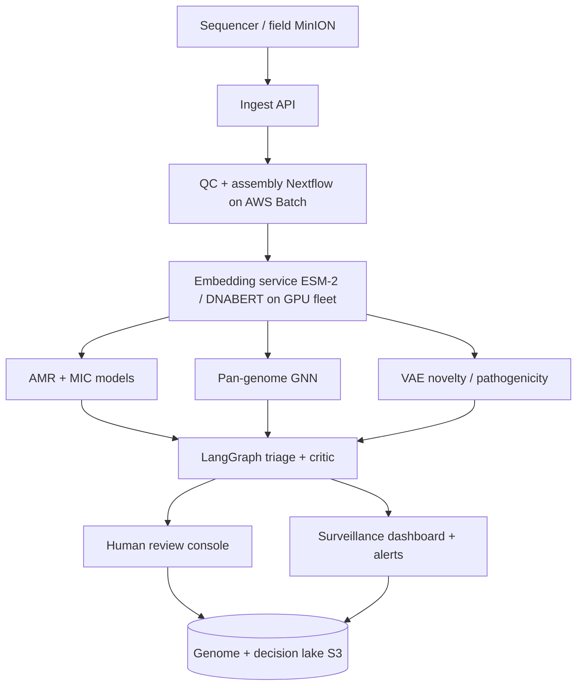

# SENTINEL at national scale

The local prototype is deliberately small and honest. This document describes how
the *same architecture* scales to a production biosurveillance platform. The logic
of every node is identical to the demo — only the data, models, and infrastructure grow.

## 1. From gene-presence to foundation-model embeddings

| Prototype (local) | Production (scaled) |
|-------------------|---------------------|
| Gene presence/absence from BV-BRC `sp_gene` | **ESM-2 650M** protein-language-model embeddings of every CDS; **DNABERT-2** for nucleotide context |
| XGBoost binary AMR call | Multi-task heads: per-antibiotic **MIC regression** + pathogenicity + host-range |
| Nearest-neighbour Jaccard novelty | **VAE reconstruction-error** OOD score on embedding space (PathogenFinder2-style) |
| Single species / antibiotic | All ESKAPE + foodborne taxa; pan-genome **GNN** (PyTorch Geometric) on assembly graphs |

The PathogenFinder2 result (whole-genome pathogenicity prediction on *novel* bacteria
via protein language models, trained on 21,000+ genomes) is the north star for the
novelty/pathogenicity head.

## 2. Architecture

## 3. Infrastructure (AWS reference, vendor-agnostic)

- **Ingest & orchestration:** EventBridge + SQS + Lambda trigger Nextflow DSL2 pipelines on **AWS Batch** (Spot for assembly, on-demand GPU for embeddings).
- **Embedding fleet:** ESM-2 / DNABERT served on GPU (A100/H100) with batching; embeddings cached in a vector store keyed by sequence hash so each protein is embedded once.
- **Training:** distributed multi-GPU (PyTorch DDP) on the full BV-BRC / GenomeTrakr / Enterobase corpus; experiment tracking with MLflow; group/lineage-aware CV at scale (split by MLST / cgMLST cluster, not random).
- **Streaming surveillance:** continuous pull from GISAID, NCBI Pathogen Detection, FDA GenomeTrakr, PulseNet; new isolates auto-triaged within minutes.
- **Storage:** genome + decision lake on S3 with full lineage of every model version and input (reproducibility + audit).
- **Serving:** the LangGraph agent runs as a durable workflow; the critic node can call an LLM (Claude) with RAG over CARD/VFDB/clinical guidelines for narrative rationale, grounded and cited.

## 4. Validation & governance

- **Lineage-split evaluation** (e.g. hold out entire ST258 clade) to prove the model survives new clones — the failure mode random splits hide.
- **Calibration & abstention:** report calibrated probabilities; abstain + escalate below a confidence floor (already prototyped here).
- **Drift monitoring:** track embedding-space drift and AMR-gene prevalence over time; trigger retraining.
- **Explainability of record:** every automated decision ships with SHAP / integrated-gradients attributions and a human-readable rationale — auditable by regulators.
- **Human-in-the-loop:** AI triages and prioritises; a scientist confirms before any reportable action. SENTINEL never auto-decides on novel or low-confidence cases.
